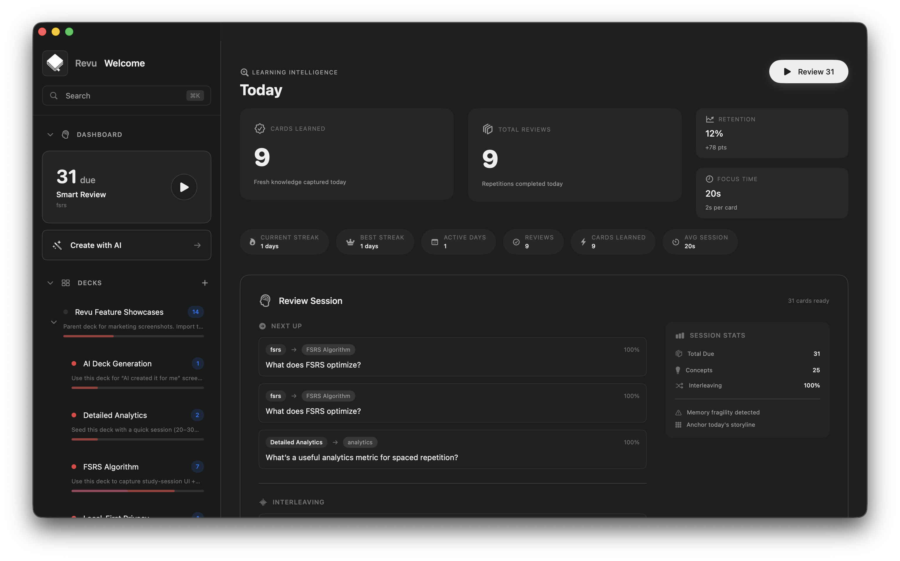
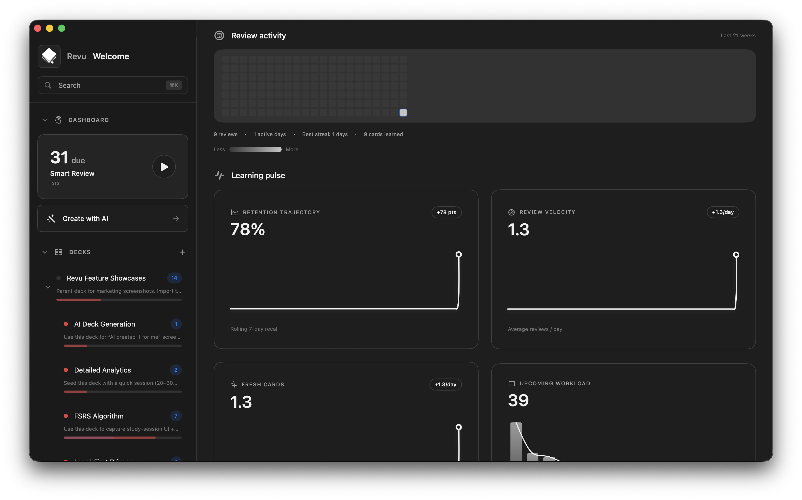

<div align="center">

# Revu

**Local-first spaced repetition for macOS.**\
Decks, cards, exams, study guides, and FSRS-powered review sessions in one desktop workspace.

[](https://github.com/julb/revu-swift)
[](https://swift.org)
[](LICENSE)



</div>

---

Revu is an opinionated macOS study app built around real workflows. It uses [FSRS](https://github.com/open-spaced-repetition/fsrs4anki) scheduling, stores everything locally, and gives you a dense, keyboard-friendly interface that makes serious studying feel organized.

This is a standalone, fully functional version of the app published as open source. The commercial product continues at [revu.cards](https://revu.cards).

## Features

- **FSRS-based review engine** -- spaced repetition scheduling that adapts to your memory, not just intervals on a timer
- **Full study workspace** -- decks, nested folders, cards, exams, study guides, courses, and review history in one place
- **Study session forecasting** -- see upcoming workload, retention trajectory, and review velocity
- **Rich import pipeline** -- Anki (.apkg, .colpkg, profiles), CSV/TSV, Markdown blocks, and Revu JSON
- **Local-first architecture** -- SQLite-backed, no account required, no network dependency, fast
- **SwiftUI design system** -- a real token-based system (spacing, typography, color, radius, shadow, animation) behind every screen
- **Keyboard-driven workflows** -- built for speed, not clicking through modals
- **Export and backup** -- full-fidelity Revu JSON export with stable identifiers

## Screenshots

<table>
<tr>
<td></td>
<td></td>
</tr>
<tr>
<td><em>Learning pulse -- retention, velocity, and workload forecasting</em></td>
<td><em>Study session -- multiple-choice with FSRS scheduling</em></td>
</tr>
<tr>
<td></td>
<td></td>
</tr>
<tr>
<td><em>Import decks from Anki, spreadsheets, Markdown, or JSON</em></td>
<td><em>Card review with markdown and LaTeX rendering</em></td>
</tr>
</table>

## Getting Started

**Requirements:** macOS 14+, Xcode 16+

Open `Revu.xcodeproj` in Xcode and run the **Revu** scheme. No environment variables or backend setup needed.

```bash
# Build from the command line
xcodebuild -project Revu.xcodeproj -scheme Revu -destination 'platform=macOS' build

# Run tests
xcodebuild test -project Revu.xcodeproj -scheme RevuTests -destination 'platform=macOS'
```

App data is stored locally at:

```
~/Library/Application Support/revu/v1/
├── revu.sqlite3       # Local database
├── attachments/       # Imported media
└── backups/           # Export staging
```

## Architecture

Revu follows MVVM with actor-isolated persistence and pure scheduling logic:

```
Revu/Revu/
├── App/           App entry, commands, workspace bootstrap
├── Views/         SwiftUI screens and reusable components (no business logic)
├── ViewModels/    @MainActor state and UI orchestration
├── Services/      Forecasting, session progression, import/export coordination
├── SRS/           FSRS scheduler and review math (pure, no side effects)
├── Store/         Actor-based SQLite persistence, DTOs, repositories
├── Import/        Anki, CSV, Markdown, JSON parsers
└── Export/        Backup generation

RevuTests/         Swift Testing suite
docs/              Architecture, import/export spec, UI design system
```

Key design decisions:

- **Views have no business logic.** All mutations go through view models and services.
- **SRS algorithms are pure functions.** Inputs are card state, review history, and settings. No side effects, easy to test.
- **Storage is actor-isolated.** `SQLiteStore` handles schema management and concurrency; repositories provide the async API.
- **Design system is token-based.** Spacing, color, typography, radius, shadow, and animation are all defined in [`DesignSystem.swift`](Revu/Revu/Support/DesignSystem.swift) with reusable components in [`NotionStyleComponents.swift`](Revu/Revu/Views/Common/NotionStyleComponents.swift).

See [`docs/architecture.md`](docs/architecture.md) for the full module overview, [`docs/import-export.md`](docs/import-export.md) for format specs and merge behavior, and [`docs/ui-design-system.md`](docs/ui-design-system.md) for the canonical UI rules.

## Contributing

Contributions are welcome. See [`CONTRIBUTING.md`](CONTRIBUTING.md) for guidelines.

The short version: keep PRs focused, follow the MVVM split, use design system tokens instead of magic numbers, run the test suite before opening a PR, and check for accidental private strings in changed files.

Bug reports should include macOS version, reproduction steps, and sample data if the issue involves import or scheduling.

## License

[GPL-3.0-only](LICENSE). The Revu name and logo are trademarks and are not licensed for reuse under the GPL.

> The commercial product with sync, AI features, and the latest updates lives at [revu.cards](https://revu.cards). This repo is the standalone macOS app -- fully functional, open source, and a solid codebase for anyone interested in local-first software, SwiftUI desktop apps, or spaced-repetition tooling.
